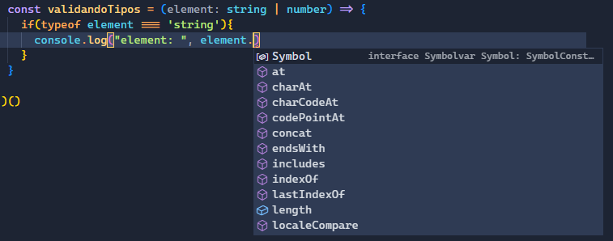
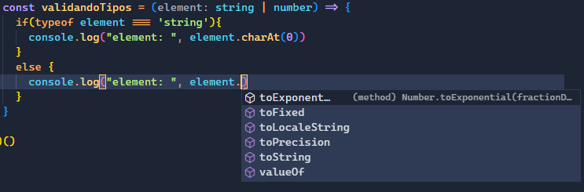

# Fundamentos de TypeScript

Practica de TypeScript seguida del curso [Fundamentos de TypeScript](https://platzi.com/cursos/typescript/)

## Compilar/Transpilar archivos TypeScript
Mediante la libreria `tsc` es posible transpilar archivos `.ts` a `.js`, siendo estos últimos los que lee el navegador.

### `Compilado`
```bash
npx tsc folder/file.ts
```
obtendremos un archivo `file.js`

### `Compilado a una versión especifica`
```bash
# npx tsc folder/file.ts --targert [VERSION]
npx tsc folder/file.ts --targert es6
```
Con la instrucción `target` le indicames que transpile a la versión que le indicamos, esto es útil cuando trabajamos sobre distintas versiones de JavaScript.

### `Enviar compilado a una ruta distinta`
```bash
# npx tsc folder/file.ts --outDir [RUTA]
npx tsc folder/file.ts --outDir dist
```
Va a crear el archivo `file.js` en el directorio `dist/`

## Compilado global
Compilar manualmente archivo por archivo no es lo más viable, por eso la libreria `tsc` nos provee una solución utilizando un archivo de configuración llamado `TSConfig.json`.

En la terminal corremos el comando
```bash
npx tsc --init
```
y obtendremos el siguiente output:

```bash
Created a new tsconfig.json with:

  target: es2016
  module: commonjs
  strict: true
  esModuleInterop: true
  skipLibCheck: true
  forceConsistentCasingInFileNames: true


You can learn more at https://aka.ms/tsconfig
```
El resultado anterior indica cuales son las configuraciónes que ya estan precargadas en el archivo `TSConfig.json` que se creó en la raíz del proyecto.

El siguiente comando permite transpilar en tiempo real los archivos `.ts`:
```bash
npx tsc --watch
```

## Tipado en TypeScript
Es el cómo declaramos una variable, esto hace referencia a la asignación del tipo de dato, conocido como **type annotation**, de este modo evitamos la mezcla de tipos de datos en una sola variable.

JavaScript a diferencia de TypeScript, nos da mucha flaxibilidad a la hora de "tipar" las variables, ya que podemos tener una variable _string_ y luego le asignamos un valor _boolean_. 

```js
// file.js
let test = null // tipo: null
test = "hola" // tipo: string
test = 333 // tipo: number
test = false // tipo: boolean
test = undefined // tipo: undefined
test = [] // tipo: array

test = { tipo: // objeto
  name: "Paho",
  lastName: "Alapizco"
}

test = (x) => console.log(x) // tipo: función
```
Este tipo de flexibilidad sino la manejamos correctamente podemos incurrir en generar bugs u obtener errores inesperados en nuestro código.

Con TypeScript podemos evitar errores de tipado y anomalías en el código.
En JS declaramos una variable de la siguiente forma:

```js
// file.js
let totalAmount = 20
```
Al momento de asignarle el `20` a la variable `totalAmount` JS sabe que es de tipo  numérica, pero a medida que código crece el tipo de dato puede cambiar.

La forma de declarar una variable en TypeScrip es la siguiente
```js
// file.ts
let totalAmount: number = 20
```
Se de clara la variable `totalAmount` seguida de dos puntos (`:`) los cuales separa la declaración del **type annotation** donde le decimos al código que esa variables `number`, con esta declaración la variable `totalAmount` solo aceptara valores numéricos a lo largo de todo el código o su scope.

## Tipos inferidos
A partir de la inicialización de una variable TypeScrip deduce (ó infiere) el tipo de dato que representa la variable, y en todo el ciclo de vida de esa variable solo aceptara valores correspondientes al tipo de dato asignado al inicio.

```js
  let saludo = "Hola" // tipo: String
  /*
  ...
  */
  saludo = 123 // error
```
### Nombres de variables iguales
TypeScript marcará como error aquellas variables con el mismo nombre a pesar de estar en archivos distintos. Esto no sucederá en entornos preconfigurados como por ejemplo Angular o React, ya que estos trabajan de forma modular o tienen un alcance (scope) para cada variable.

Para que evitar este inconveniento podemos utilizar una función auto ejecutada en cada archivo `.ts`:

```js
( () => {
  let nombre = "Paho"
})()
```

## Type: number
El tipo de dato `number` se utiliza para variables que contendran números positivos, negativos y decimales.

### Operaciones
Con JavaScript, una variable `number` puede concatenarse con un valor o variable `string` utilizacon el operador `+`:
```js
// file.js
let edad = 31 // number
edad = edad + "1" // "311" --> Stirng
```
En el ejemplo anterior lo que JS hizo fue concatenar la cadena "1" al valor de la variable `edad`, conviertiendo así a esta variable en string. Este tipo de prácticas puede incurrir en confusiones y errores.
Utilizando TypeScrit tenemos restricciones:
```js
// file.ts
let edad = 31 // number, gracias a la inferencia TS resuelva la variable como number
edad = edad + "1" // error
edad = edad + 1 // 32
```

### Variables sin inicializar
Serán señalados como errores aquellas variables que queramos usar sin haberles dado un valor inicial:

```js
// file.js
let edad: number // number

consle.log("Mi edad es:", edad) // TS lo marca como error.
```
Cuando no vamos a inicializar una variable al momento de declararla, debemos indicarle el tipo de dato que va a recibir, de lo contrario TypeScript no podra inverir su tipo de dato.

### Covnersión de string a number
El metodo para hacer la conversión es `parseInt` y solo funciona con string que contenan valores `[0-9]` incluido el punto para detonar valores decimales.

```js
let precio: number = parseInt("123")

let numeroString: string = "100"
let nuevoNumero: number
nuevoNumero = parseInt(numeroString)

nuevoNumero = parseInt("hola") // Retornara un NaN (Not a Number)

```

### Binarios y Hexadecimales
TypeScript nos puede indicar error si intentamos definir números binarios que tengan números que no sean 0 o 1 y si declaramos hexadecimales usando valores fuera del rango:
```js
//Binarios: se definen colocando "0b" al inicio del valor
let primerBinario = 0b1010
let segundobinario = 0b1210 // error, 2 es inválido

//Hexadecimales: se definen colocando "0x" al inicio del valor
let primerHexa = 0xfff
let segundoHexa = 0xffz // error, "z" es inválido
```

## Type: boolean
Los tipos de dato `boolean` solo pueden tomar dos valores `true` o `false`.

```js
let isEnable: boolean = true
let isNew = false // Toma el tipo boolean gracias a la inferencia.

isNew = 50 // error
isEnable = "false" // error
```

## Type: string
Los tipos de dato string nos permiten almacenar valores alfanuméricos/cadena de caracteres. 
Podemos definirilo de varias formas:
1. Comillas simples:
```js
let comillaSimple = 'Esto es un string'
let comillaSimpleOk = 'Esto es un string que usa "comillas dobles"'
let comillaSimpleErr = 'Esto es un incorrecto con comillas 'simples' dentro de comillas simples' // error
```
2. Comillas dobles:
```js
let comillaDoble = "Esto es un string"
let comillaDobleOk = "Esto es un string que usa 'comillas simples'"
let comillaDobleErr = "Esto es un incorrecto con comillas "dobles" dentro de comillas dobles"
```
3. Backticks:
```js
let backtick = `Esto es un string`
let backtickComSimple = `Esto es un string que usa 'comillas simples'`
let backtickComDoble = `Esto es un stringq ue usa "comillas dobles"`
```
La última forma de asignar un valor `string` tiene varias ventajas, las dos más importantes:
1. Puede incluir textos en múltiples líneas:
```js
let texto = `
  Este es 
  un texto
  con 3 líneas
`
```
2. Podemos concatenar dentro de un mismo `string`
```js
let nombre: string = "Paho"
let edad: number = 31

let concatenar = `Hola mi nombres es ${nombre} y tengo ${edad} años.`
```

## Type: array
Los arrays son una colección ordenada de datos. Al declarar un array de un determinado tipo de dato lo debemos hacer con la siguiente sintaxis: `data_type[]` => `number[]` esto es un arreglo de numeros, `string[]` arreglo de strings...

Ejemplos:
```js
// file.ts
let precios = [1,2,3,4.5] // number[]
precios.push(5)
console.log("precios", precios)

precios.push("hola") // error
```
En el código anterior TypeScript sabe que la variable `precios` es de tipo `number[]`, por lo cuál marca un error al intentar agregar un elemento que no sea de tipo `number`.

Si intentamos hacer operaciones con un array que contiene un detemrinado tipo de dato utilizando otro tipo TypeScript nos marcara error:
```js
// file.ts
let mensaje = ["Buenos", "días"] // string[]
mensaje.map(item => item * 2) // error
```

JavaScript tiene una ventaja con los arrays, y es que en ellos podemos guardar diferente información, ya sea númerica, texto, etc. 

En TypeScript también podemos incluir más de un tipo de dato en un array, para hacerlo necesitamos indicarlo de la siguiente manera:
```js
let dosTipos: (number | string)[] = ["hola",2,4,6,"mundo"]
console.log("dosTipos:", dosTipos)

let otrosPrecios: (boolean | number)[]
otrosPrecios = [True] 

otrosPrecios.push("Hola") // error
```

## Type: any
`any` Es un tipo de dato exclusivo de TypeScript y nos permite asignarle a la variable cualquier valores (como si estuvieramos trabajando con variables de JS). 

No es recomendable utilizar este tipo de dato, a menos que se este migrando un proyecto de JavaScript a TypeScript y no se conozca a ciencia cierta el tipo de dato que reciven las variables, esto con el fin de no quebrar nada en el proyecto. 
Por otro lado, si el proyecto ya esta consolidado con TypeScript es una mala práctica hacer uso de `any`.

```js
let dynamic: any
dynamic = 0 // type: numeric
dynamic = '' // type: string
dynamic =  null // type: null
dynamic = {} // type: object
dynamic = [] // type: array
```
Una de las desventajas de utilizar `any`, es que no podemos acceder a los metodos propios de un tipo de datos especifico, como `tolowerCase()` de los `string` o `toFixed()` de los `numer`. <br>
TypeScript nos da dos formas de "setear" o cambiar el tipo de dato any a otro en particular.
```js
dynamic = "Hola" // type: any
const str = (dynamic as string) // type: string
str.toUpperCase() // Función del tipo de dato string

dynamic = 123 // type: any
const num = (<number>dynamic) // type: number
num.toFixed() // Función de un tipo numérico
```
Si bien `any` nos brinda "flexibilidad" para manejar varios tipos de datos en una sola variable, no es aconsejable su uso, incluso es una malapractica.

## Union types
Nos da la flexibilidad de asignar más de un tipo de dato a una variable, pero con las restricciones de solo aceptar valores correspondientes a los tipos indicados.

La forma de aplicar `union types` es similar a lo que vimos con los [arrays](#Type:-array) con varios data types.

```js
let dynamicUT: (string | number)

dynamicUT = "123" // type: string
console.log("dynamicUT:", typeof dynamicUT, dynamicUT)

dynamicUT = 456 // type: number
console.log("dynamicUT:", typeof dynamicUT, dynamicUT)
```
Una ventaja de utilizar los union types, es que nuestro editor de código detecta que podemos hacer uso de los metodos correspondientes a los tipos de datos con los que declaramos la variable.

```js

dynamicUT = "hola" // type: string
console.log("dynamicUT:", dynamicUT.toUpperCase()) // HOLA

dynamicUT = 456.123 // type: number
console.log("dynamicUT:", dynamicUT.toFixed(1)) // 456.1
```
Si segmentamos en un if por el tipo de dato, el editor lo identifica y dependiendo el tipo de dato que se este evaluando son los metodos que nos provee.

```js
const validandoTipos = (element: string | number) => {
  if(typeof element === 'string'){
    console.log("element: ", element.charAt(0))
  }
  else {
    console.log("element: ", element.toFixed(2))
  }
}
```
| strings | numbers |
|--|--|
|  |  |

Los union types son en definitiva una mejor alternativa en tipado dinamico sobre `any`.

## Alias y Literal types
### Alias
Los Alias nos permiten darle un nombre a un tipo de dato o a un conjunto de tipos de datos que posteriormente se van a asignar a variables.

Definición de un alias:
```js
type UserID = string | number
```
Reglas para crear un alias:
- `type`: Palabra recervada propia de TypeScript, con ella le decimos que estamos creando un "tipo de dato" nuevo.
- `PascalCase`: Forma de nombrar a los alias, empezanmdo con Mayúscula y separar con Mayúscula el inicio de cada palabra nueva: `UnaVariableNueva`.
- `=` : A diferencia de los dos puntos (`:`) al crear el alias se le asigna los tipos de datos.
- `|`: Utilizar cuando se acepta más de un tipo de dato.

Implementamos el alias:
```js
let userId: UserID

userId = '123'
userId = 456
userId = {} // error
```
Una ventaja de utilizar alias, esque podemos ahorrar código y hacerlo más legible cuando en más de una ocasión necesitamos utilziar variables con los mismos tipos de datos que nuestro alias:
```js
const validandoTipos = (element: UserID) => {
  if(typeof element === 'string'){
    console.log("element: ", element.charAt(0))
  }
}
```
### Literal types
Gracias a esto podemos definir de forma literal y explicita los posibles valores que puede recibir una variable.
```js
let shirtSize: 'S' | 'M' | 'L' | 'XL'
shirtSize = 'S' // ok
shirtSize = 'M' // ok
shirtSize = 'L' // ok
shirtSize = 'xl' // Error, porque xl en minuscula no existe en las posibles opciones
shirtSize = 'jkgsd' // Error, no existe en las posibles opciones.
```
Los `literal types` son case sensitive, si definicos valores en mayúscula no podemos utilizar minúscula porque TypeScript nos marcará un error.

### Alias + Literal Types
Posdemos combiinar ambos conceptos para hacer aun más potente, escalable y reutilizable nuestro código:
```js
type Sizes = 'S' | 'M' | 'L' | 'XL';


const yourSize = ( userSize: Sizes ) => {
    console.log(`Tu talla es ${userSize}`);
}

let shirtSize: Sizes;
shirtSize = "M";
yourSize(shirtSize) // M
```

 ## Funciones
Asignar un tipo (tipos) de dato a los parametros de una función nos ayudan a llevar a cabo una implementación más segura de nuestro código.

Definición de una función con parametros tipados:
```js
type Sizes = 'S' | 'M' | 'L' | 'XL'; //Alias y Tipos Literales

const createProductJson = (
  title: string,
  createdAt: Date,
  stock: number,
  size: Sizes
) => {
  return {
    title,
    createdAt,
    stock,
    size
  }
}
```
> **NOTA:** El tipo `Date` es el único que podemos definir con si primer letra en mayúscula, a diferencia de los otros tipos de datos como number, etstring, etc. es una mala practica.

Implementación:
```js
const producto1 = createProductJson(
  "titulo",
  new Date('02/06/2023'),
  30,
  'S'
  // 'XS' // Error porque el valor XS no existe en literal type "Sizes"
)

// TS nos marcara un error porque no le mandamos el último parametro.
const producto2 = createProductJson(
  "titulo",
  new Date('02/06/2023'),
  30,
)

```
Existen funciones que no requieren estrictamente que se envien todos los parametros, a estos se les llama "parametros opcionales" y se definen con `?` al final del nombre del parametro. 
```js
type Sizes = 'S' | 'M' | 'L' | 'XL'; //Alias y Tipos Literales

const createProductJsonV2 = (
  title: string,
  createdAt: Date,
  stock: number,
  size?: Sizes
) => {
  return {
    title,
    createdAt,
    stock,
    size
  }
}

const producto2V2 = createProductJsonV2(
  "titulo",
  new Date('02/06/2023'),
  30,
)
```
> **NOTA:** El lós parametros opcionales deben ir al final, de lo contrario obtendremos un error.

### Retorno
Así como con las variables, TypeScript utiliza la inferencia para determinar el tipo de dato que retorna una función, y al igual que las variables también las funciones se les asigna un tipo o varios (union types) tipos de dato.

Definición de una función utilizando inferencia
```js
const saludar = (nombre: string, apellido: string, edad?: number) => {
  let saludo = `Hola me llamo ${nombre} ${apellido}`
  saludo += edad ? `, tengo ${edad} años.` : '.'

  return saludo
}

const unSaludo = saludar('Paho', 'Alapizco') // type: string
console.log("unSaludo:", unSaludo)
```
La forma de tipar una función es colocando los dos puntos (`:`) inmediatamente despues del parentesis de cierre de la función seguida del tipo de dato que va a retornar la función


```js
const saludarV2 = (nombre: string, apellido: string, edad?: number): string => {
  let saludo = `Hola me llamo ${nombre} ${apellido}`
  saludo += edad ? `, tengo ${edad} años.` : '.'

  return saludo
}

const unSaludoV2 = saludarV2('Paho', 'Alapizco', 31) // type: string
console.log("unSaludoV2:", unSaludoV2)
```
Con TypeScript también podemos encontrar un tipo especial llamado `void` el cual indica que la función no va a retornar ningun valor.


```js
const saludandoAndo = (nombre: string, apellido: string, edad?: number): void => {
  const unSaludox = saludarV2(nombre, apellido, edad) // type: string
  console.log("unSaludo sin retorno:", unSaludox)
}

saludandoAndo('Paho', 'Alapizco', 31)
```
> **NOTA:** Si la función esta declarada como `void` e intentamos hacer un retorno TS nos los marcara como un error.

## Objetos en funciones
Cuando las funciones reciben muchos parametros podemos optimizarlas haciendo uso de un parametros pero de tipo objeto, donde le mandemos los datos necesarios para la función.

Definición de una función que recibe parametro tipado como objeto: 
```js
const saludar = (data: { nombre: string, apellido: string, edad?: number }): void => {
  let saludo = `Hola me llamo ${data.nombre} ${data.apellido}`
  saludo += data.edad ? `, tengo ${data. dad} años.` : '.'

  console.log(saludo)
}
// Sin mandar la edad
saludar({
  nombre: 'Gael', 
  apellido: 'Camacho'
})

// Mandando la edad
saludar({
  nombre: 'David', 
  apellido: 'Lopez',
  edad: 33
})
```
Al tipar como un objeto especifico el parametro que recibe la función `saludar`, podemos acceder a sus elementos como `data.key`.

## Objetos como tipos
Los alias no se limitan a solo crear "tipados" para una sola variable, sino que nos permite crear tipados para estructuras más complejas como los objetos.

La forma de definir un objeto como estructura:
```js
type Product = {
  title: string,
  price: number,
  createAt: Date,
  stock: number,
  size?: Sizes
}
```
El alias `Product` podemos utilizarlo para:
- Tipar una variable que sera un objeto.
- Tipar parametro de una función
- Tipar la serie de datos de un array.

```js
// función
const crearProducto = (producto: Product):  Product=> {
  return producto
}

// variable
let unProducto: Product = {
  title: 'Sombrero',
  price: 30,
  createAt: new Date('20230506'),
  stock: 10
}

// array
let productos: Product[] = []
productos.push(crearProducto(unProducto))
```
En un array cuando aplicamos un tipado de objetos, TypeScrip solo permitira agregar elementos que coincidan con el tipo que le asignamos, en este caso el objeto y sus tributos.
```js
productos.push("Gorra") // error
```

