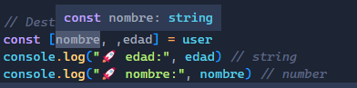
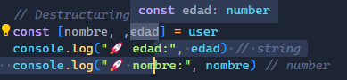
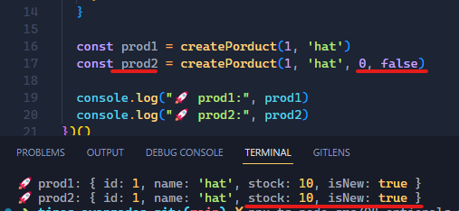
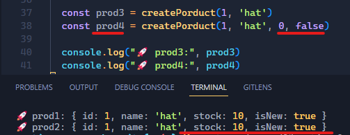

# Tipos avanzados y funciones

> :pushpin: Los fundamentos de tipado con TypeScrip se encuentran en el folder [fundamentos](../fundamentos/README.md)

## New types

### Enums
Conjunto/set de valores predefinidos. Al tipar una variable con un enum, TypeScript solo permite asignarle uno de los elementos definidos en el enum.

**`Definición`**
> :writing_hand: Es una buena práctica nombar los enums en mayúsculas.
```js
enum ROLES {
  ADMIN = 'admin',
  SELLER = 'vendedor',
  CUSTOMER = 'cliente'
}
```
**`Asignación`**
Es igual como si se asignara un tipo de dato primitivo o un alias.
```js
type User = {
  name: string,
  username: string,
  rol: ROLES
}
```
**`Implementación`**
```js
const user: User = {
  name: 'Paola',
  username: 'pahoalapizco',
  // rol: 'cliente' //error
  rol: ROLES.CUSTOMER
}
```
**Ventajas** de utilizar enum:
1. Minimiza errores en tiempo de desarrollo e ejecución
2. Ayuda al desarrollador a ser más eficiente y a evitar bugs
3. Dependiendo del editor de código que se utilice, nos brinda tooltips con guías sobre los valores que podemos utilizar de un enum.

[Documentación](https://www.typescriptlang.org/docs/handbook/enums.html)

### Tuples
Las tuplas permiten definir arrays fuertemente tipados, esto quiere decir que define el tipo de dato de cada posición del array y por ende también la longitud del mismo.

**`Definición`**
Cuando definimos un array como una tupla, debemos asignarle los valores iniciales.
```js
let userData: [string, string, number] = [] //error
let user: [string, string, number] = ['Paola Alapizco', 'pahoalapizco', 31]
```
**`Asignación`**
Si bien al inicio definimos los valores de la tupla, estos pueden cambiar en el ciclo de vida de nuestro código. Sin embargo cuando reasignamos los valores a la tupa debemos respetar el orden de los tipos de datos y la longitud.
```js
user = [] //error
user = ['Pedrito Peres'] //error
user = ['Pedrito Peres', 'pepe'] //error
user = ['Pedrito Peres', 'pepe', 20]

// Push no funciona
user.push('Fulanito')// Lo ignora
```
Al igual que con los array, con las tuplas también podemos aplicar el destructuring, con la ventaja de que ya conocemos el tipo de dato que obtendremos de cada una de las posiciones.
```js
const [nombre, ,edad] = user
console.log("🚀 edad:", edad) // string
console.log("🚀 nombre:", nombre) // number
```

**Ventajas**
1. AL utilizar editores de código como VSCode + TypeScript, son los tooltips que nos ayudan a saber exactamente con que tipos de datos estamos trabajando:

| string | number |
|--|--|
|  |  |
2. Podemos controlar el tamaño de un array.

### Unknown
Su traducción literal al español es "desconocido", es una forma de decirle a una variable en TypeScript que su tipo de dato no lo conocemos, nos da la flexibilidad del tipo `any`, pero nos advierte (o avisa) que primero debemos verificar el tipo de dato antes de aplicarle alguna funcionalidad.

**`Definición`**
```js
let unknownVar: unknown
```
**`Asignación`**
En ninguna de las asignaciones siguientes obtenemos un error, porque tenemos la flexibilidad de asignarle cualquier tipo de dato.
```js
unknownVar = "Hello" // string
unknownVar = true // bollean
unknownVar = 123 // number
unknownVar = {} // object
```

**`Implementación`**
Cuando tenemos un tipo `unknown` antes de aplicar alguna funcionalidad, como un `toLowerCase()` para los strings primero debemos verificar que el tipo de dato que contiene la variable sea un `string`.
```js
unknownVar.toLowerCase() //error

if(typeof unknownVar === "string"){
  unknownVar.toLowerCase()
}
```
La verificación de tipos también aplica cuando queremos asignar una variable uknown a una variable tipada
```js
let isBool: boolean
isBool= unknownVar // error

if(typeof unknownVar === "boolean"){
  isBool= unknownVar // error
}
```

**Ventajas**
1. Tenemos flexibilidad para asignar distintos tipos de datos a una variable.
2. Evita errores en tiempo de desarrollo al sugerirle al programador que primero verifique el tipo de dato antes de realizar cualquier acción con la variable.

> Nota: Aunque uknown tiene mayor ventaja sobre any, es recomendable evitar hacer uso de estos recursos.

## Funciones

### Parámetros opcionales y nullish-coalescing
En una función los parametros opcionales son aquellos que podemos no enviar como argumento cuando la ejecutamos.
<br>

**`Definición`**
Los parámetros opcionales llevan el simobolo `?` inmediatamente despues del nombre y se posicionan al final.
```js
// error
const createPorductWithError = (
    id: number, 
    stock?: number, // debe ir al final
    name: string, 
    isNew?: boolean
  ) => {/*...*/}


const createPorduct = (
    id: number, 
    name: string, 
    stock?: number, 
    isNew?: boolean 
  ) => {/*...*/}
```
Es la función quien se encarga de verificar si se recibio o no el parámetro y en base a eso hace algo. Algunas formas sencillas de verificar si se recibió el valor de un detemrinado parámetro son:
- `||` (or operator): Si la expresión izquierda es falsy entonces obtendremos la expresión de la derecha como resultado.
- `??`  (nullish-coalescing): Si y solo si la expresión izquierda es null o undefind entonces obtendremos la expresión de la derecha como resultado.

**`Implementación`**
Ejemplo con un or operator (`||`)
```js
const createPorduct = (
    id: number, 
    name: string, 
    stock?: number, 
    isNew?: boolean 
  ) => {
    return {
      id,
      name,
      stock: stock || 10,
      isNew: isNew || true
    }
  }

  const prod1 = createPorduct(1, 'hat')
  const prod2 = createPorduct(1, 'hat', 0, false)

  console.log("🚀 prod1:", prod1)
  console.log("🚀 prod2:", prod2)
```
El inconveniente con el operador or `||` es que evalua los valores `falsy`:
- `false`
- `0`
- `""`
- `null`
- `undefined`
- `NaN` 
En el ejemplo anterior necesitamos respetar los valores `0` y `false` que corresponden a los valores de los parámetros. 
<br>



Para solucionar ese problema existe el nullish-coalescing `??` que evaluará solo cuando sea `null` o `undefined`.
<br>

Ejemplo con nullish-coalesing operator (`??`)
```js
const createPorduct = (
    id: number, 
    name: string, 
    stock?: number, 
    isNew?: boolean 
  ) => {
    return {
      id,
      name,
      stock: stock ?? 10,
      isNew: isNew ?? true
    }
  }

  const prod1 = createPorduct(1, 'hat')
  const prod2 = createPorduct(1, 'hat', 0, false)

  console.log("🚀 prod1:", prod1)
  console.log("🚀 prod2:", prod2)
```


Utilizando `??` obtenemos los valores que requerimos asignar solo cuando no recibimos los parámetros.

**Ventajas**
1. Forma sencilla de validar si y solo si el valor es undefined o null, y respeta los valores `0`, `false` y vació `""`.

### Parámetros por defecto
Al momento de declarar la función y especificar sus parámetros en lugar de definir un parametro opcional podemos definirle su valor por defecto, así independientemente si le pasamos o no el argumento la función le asigna un valor.

**`Definición`**
Los parametros por defecto van al final.
```js
const createPorduct = (
    id: number, 
    name: string, 
    stock: number = 10, 
    isNew: boolean =true
  ) => {
    id,
    name,
    stock,
    isNew
  }
```
**`Implementación`**
```js
const prod1 = createPorduct(1, 'hat')
const prod2 = createPorduct(2, 'hat', 0, false)
const prod3 = createPorduct(3, 'hat', 25)

console.log("🚀 prod1:", prod1)
console.log("🚀 prod2:", prod2)
console.log("🚀 prod3:", prod3)
```

**Ventajas**
1. Mayor legibilidad de código.
2. Menos líneas de código.
